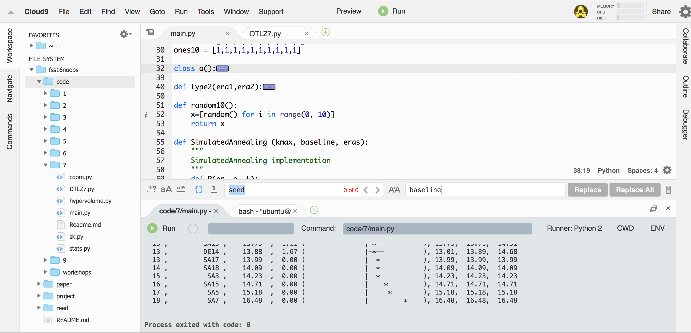

## Early termination: Simulated annealing, MaxWalkSat and Differential Evolution for DTLZ7 model.
> (Learning when enough is enough)

#### Running the source
$ python main.py

### Abstract
Various optimizers based on evolutionary algorithms are metaheuristics, meaning they do not guarantee a global optima. Hence in order to increase our chances of reaching the global optima, it’s important to run an optimizer on a problem for multiple “eras”, each era containing multiple evaluations. However, there is a chance that an optimizer will find a near-optima before all the evaluations/iterations finish. In this case, the optimizer produces no better result after it has found a near-optima and it can be stopped. Detecting when to stop further evaluations of the optimizer is the primary objective of this experiment. By implementing 3 different ways to detect this “early termination” criteria for Simulated annealing, MaxWalkSat and Differential Evolution, we compare their results to demonstrate which optimizer among these is best suited for DTLZ7 model.


### Introduction


#### Simulated annealing


Simulated annealing derives its analogy from physical annealing of solids, where a solid is heated to a very high temperature and then it’s allowed to cool down very slowly until it reaches its most natural form - this avoid crystal defects. Simulated annealing exploits this phenomena in the search of global optima for a discrete optimization problem. During the initial stage of the algorithm, the algorithms performs “crazy jumps” while exploring search space. This makes it possible to avoid getting stuck in local optima and explore the search space more thoroughly. In the later stages, the number of crazy jumps are reduced and the space around best solution found till now is explored. 


Since it requires only the best solution and current solution in memory, it is a very memory efficient algorithm. Hence it was best suited in days when RAM was limited.


#### Max-walkSat
MaxWalkSat is a non-parametric stochastic method for sampling the landscape of the local region. MaxWalkSat introduces the idea of local search along with global search. The idea is that - when randomly searching a space by mutating all dimensions, sometimes fixate on improving things on just one dimension, i.e. you fixate on one variable and try all it’s values. 70-75% of the time we perform local search and remaining time we perform global search. Also there is a concept of retries - when you know that this solution isn’t going any closer to optimized one, forget everything and restart.

Historically, it is a very successful algorithm - it can quickly find solutions for otherwise time consuming problems like Latin Square. 

#### Differential Evolution
Differential Evolution is a method that optimizes a problem by iteratively trying to improve a candidate solution with regard to a given measure of quality. Such methods are commonly known as meta heuristics as they make few or no assumptions about the problem being optimized and can search very large spaces of candidate solutions. However, meta heuristics such as DE do not guarantee an optimal solution is ever found.

DE is used for multidimensional real-valued functions but does not use the gradient of the problem being optimized, which means DE does not require for the optimization problem to be differentiable as is required by classic optimization methods such as gradient descent and quasi-newton methods. DE can therefore also be used on optimization problems that are not even continuous, are noisy, change over time, etc.

DE optimizes a problem by maintaining a population of candidate solutions and creating new candidate solutions by combining existing ones according to its simple formulae, and then keeping whichever candidate solution has the best score or fitness on the optimization problem at hand. In this way the optimization problem is treated as a black box that merely provides a measure of quality given a candidate solution and the gradient is therefore not needed. [8]

#### Scott-knott and Effect size tests

Scott-Knott (SK) is a hierarchical clustering algorithm used a tool for exploratory data analysis. 
It was designed to help researchers working with an ANOVA experiment, wherein the comparison of treatment means is an important step in order, to find distinct homogeneous groups of those means whenever the situation leads to a significant F-test.
The SK procedure uses a clever algorithm of cluster analysis, where, starting from the whole group of observed mean effects, it divides, and keeps dividing the subgroups in such a way that the intersection of any of the two formed groups remains empty. In the words of A.J. Scott and M. Knott: "We study the consequences of using a well-known method of cluster analysis to partition the sample treatment means in a balanced design and show how a corresponding likelihood ratio test gives a method of judging the significance of the difference among groups obtained". [7]


Effect size is a simple way of quantifying the difference between two groups that has many advantages over the use of tests of statistical significance alone. Effect size emphasises the size of the difference rather than confounding this with sample size. [9]

### Approach and Implementation
Following are the three optimizers compared for early termination:

1. Simulated Annealing (SA)
2. MaxWalkSat (MWS)
3. Differential Evolution (DE)

If the code runs in "eras" of, say, 100 evals per era, how to test in era X that there has been no future improvement expected? For this we use following 3 comparators:

##### Type 1 comparator:
The simplest way to detect early termination is to just compare median performance scores for individuals of a population. The performance score used is Continuous Domination (CDom) as it tends to perform better than Binary Domination (BDom) because it compares individuals in a way that score is proportional to dominance. Also, with more number of objectives, CDom tends to perform better than BDom. Differences between Xi and Yi are registered on an exponential scale, so any differences SHOUT louder.

##### Type 2 comparator
Use effect size tests to just if the performance scores are not changing between two consecutive eras. When the improvement in scores between two eras is not significant, it is an indication of early termination.

The Vargha and Delaney's A12 statistic is used to compare two consecutive eras. According to Vargha and Delaney, a small difference between two populations is 56% or less. Thus 0.56 was used as the threshold.

Krall's Bstop [8] method is incorporated to come up with the number of eras that should be added or subtracted.


Pseudo-code for type 2 comparator:
```unix
Krall's Bstop method:
* For each objective do
   If any "improvement", give yourself five more lives
   Here, "improvement" could be
       Sort the values for that objective in era and era+1
       Run the fast a12 test to check for true difference
       Be mindful of objectives minimizing or maximizing.
   * If no improvement on anything,
       Lives - 1


```

##### Type 3 comparator
For type3, we use effect size + hypothesis test (bootstrap) to judge no improvement in final era of multiple optimizers. 500 bootstraps was used with A12 and Scott-Knott. The stat.py contains rdivdemo method that tabulates the results in following manner showing median and inter-quartile range.

### Results

Number of early terminations achieved by the 3 optimizers:

| Optimizer | Average  #Early terminations  |
|-----------|-------------------------------------|
| Simulated Annealing        | 4                             |
| MaxWalkSat       | 7                              |
| Differential Evolution        | 13                              |


Output:
```unix
rank ,         name ,    med   ,  iqr 
----------------------------------------------------
   1 ,          DE4 ,    11.06  ,  1.59 (      ---*-    |              ), 10.17,  11.07,  11.76
   1 ,         DE19 ,    11.26  ,  1.72 (       --*-    |              ), 10.32,  11.27,  12.04
   2 ,          DE7 ,    12.41  ,  1.78 (          ---*-|              ), 11.58,  12.43,  13.36
   2 ,        MWS15 ,    12.42  ,  1.97 (          ---*-|              ), 11.59,  12.42,  13.56
   2 ,         DE20 ,    12.51  ,  1.76 (           --*-|              ), 11.81,  12.51,  13.57
   2 ,        MWS10 ,    12.57  ,  2.15 (          ---*-|              ), 11.45,  12.57,  13.60
   3 ,         MWS3 ,    12.59  ,  2.26 (           --*-|-             ), 11.79,  12.59,  14.05
   3 ,        MWS16 ,    12.64  ,  2.03 (           --*-|-             ), 11.91,  12.64,  13.94
   3 ,         MWS2 ,    12.67  ,  2.04 (           --*-|              ), 11.73,  12.67,  13.77
   3 ,         MWS8 ,    12.67  ,  2.26 (           --*-|-             ), 11.74,  12.67,  14.00
   3 ,         DE12 ,    12.71  ,  1.42 (            -*-|              ), 12.08,  12.73,  13.49
   3 ,         MWS5 ,    12.75  ,  1.99 (           ---*|-             ), 11.86,  12.75,  13.85
   3 ,        MWS19 ,    12.76  ,  2.09 (           ---*|-             ), 11.79,  12.76,  13.89
   3 ,        MWS13 ,    12.77  ,  2.30 (          ----*|-             ), 11.51,  12.77,  13.82
   3 ,         DE15 ,    12.81  ,  0.90 (            --*|              ), 12.36,  12.85,  13.26
   3 ,         MWS1 ,    12.82  ,  2.06 (           ---*|-             ), 11.82,  12.82,  13.89
   3 ,        MWS12 ,    12.82  ,  1.89 (           ---*|              ), 11.86,  12.82,  13.75
   3 ,        MWS11 ,    12.84  ,  2.45 (          ----*|-             ), 11.50,  12.84,  13.96
   3 ,         MWS4 ,    12.93  ,  2.19 (           ---*|-             ), 11.86,  12.93,  14.06
   3 ,          DE6 ,    12.95  ,  2.41 (            --*|---           ), 12.09,  12.96,  14.50
   3 ,          DE8 ,    13.01  ,  2.88 (          ----*|--            ), 11.35,  13.04,  14.22
   3 ,        MWS20 ,    13.04  ,  2.15 (           ---*|-             ), 11.78,  13.04,  13.93
   3 ,        MWS17 ,    13.09  ,  2.41 (           ----*--            ), 11.83,  13.09,  14.24
   4 ,         MWS7 ,    13.11  ,  1.99 (            ---*--            ), 12.23,  13.11,  14.22
   4 ,         MWS9 ,    13.13  ,  1.87 (           ----*-             ), 11.99,  13.13,  13.86
   4 ,          SA3 ,    13.14  ,  2.48 (              -*-----         ), 12.90,  13.14,  15.39
   4 ,         DE13 ,    13.17  ,  1.72 (            ---*-             ), 12.28,  13.17,  14.00
   4 ,        MWS14 ,    13.18  ,  2.22 (           ----*--            ), 12.03,  13.18,  14.25
   4 ,         MWS6 ,    13.22  ,  2.58 (           ----*--            ), 11.79,  13.22,  14.37
   4 ,        MWS18 ,    13.24  ,  2.55 (           ----*--            ), 11.91,  13.24,  14.47
   5 ,          SA8 ,    13.33  ,  1.61 (              -*---           ), 12.97,  13.33,  14.58
   5 ,         DE14 ,    13.33  ,  1.36 (             --*-             ), 12.53,  13.34,  13.89
   5 ,         SA20 ,    13.43  ,  1.93 (             --*--            ), 12.49,  13.43,  14.42
   5 ,         DE17 ,    13.55  ,  1.42 (              -|*-            ), 12.80,  13.58,  14.23
   6 ,         SA15 ,    13.67  ,  2.11 (              -|*---          ), 13.00,  13.67,  15.11
   6 ,          SA4 ,    13.67  ,  1.79 (               |*---          ), 13.21,  13.67,  15.00
   6 ,          SA7 ,    13.75  ,  2.44 (             --|*---          ), 12.56,  13.75,  15.00
   6 ,         DE11 ,    13.84  ,  1.60 (              -|-*-           ), 12.93,  13.88,  14.54
   6 ,          DE2 ,    13.88  ,  0.78 (               |-*            ), 13.55,  13.88,  14.33
   6 ,          DE3 ,    13.93  ,  1.55 (               |-*-           ), 13.11,  13.94,  14.65
   6 ,         DE10 ,    13.98  ,  1.96 (              -|-*--          ), 13.03,  13.99,  14.98
   6 ,          DE1 ,    14.03  ,  1.30 (               |-*-           ), 13.29,  14.06,  14.59
   6 ,         SA19 ,    14.04  ,  1.83 (               |-*---         ), 13.54,  14.04,  15.37
   6 ,         DE18 ,    14.23  ,  2.05 (              -|--*-          ), 13.00,  14.26,  15.05
   6 ,          DE5 ,    14.28  ,  2.10 (              -|--*-          ), 12.96,  14.29,  15.06
   6 ,          DE9 ,    14.46  ,  2.78 (             --|--*--         ), 12.48,  14.48,  15.26
   7 ,         SA14 ,    14.48  ,  1.04 (               |--*           ), 13.71,  14.48,  14.75
   7 ,         DE16 ,    14.49  ,  1.39 (               |---*          ), 13.77,  14.51,  15.16
   7 ,         SA18 ,    14.50  ,  1.72 (               |---*-         ), 13.54,  14.50,  15.26
   8 ,         SA12 ,    14.55  ,  1.92 (               |---*--        ), 13.61,  14.55,  15.54
   8 ,         SA11 ,    14.66  ,  2.58 (               |---*---       ), 13.46,  14.66,  16.04
   8 ,         SA16 ,    14.81  ,  1.80 (               |---*-         ), 13.52,  14.81,  15.32
   8 ,          SA9 ,    14.84  ,  0.15 (               |    *         ), 14.84,  14.84,  14.99
   8 ,          SA1 ,    14.85  ,  1.43 (               |  --*-        ), 14.28,  14.85,  15.71
   8 ,         SA13 ,    15.01  ,  3.21 (               | ---*-----    ), 13.80,  15.01,  17.01
   8 ,         SA17 ,    15.01  ,  2.20 (               |----*-        ), 13.44,  15.01,  15.64
   8 ,          SA5 ,    15.30  ,  3.75 (               |-----*----    ), 13.41,  15.30,  17.16
   8 ,         SA10 ,    15.59  ,  2.37 (               | -----*-      ), 13.92,  15.59,  16.28
   8 ,          SA2 ,    15.97  ,  2.19 (               |-------*      ), 13.77,  15.97,  15.97
   9 ,          SA6 ,    17.93  ,  3.95 (               | -----------* ), 13.97,  17.93,  17.93


```



Below is an ranking of the 3 optimizers: The eras for all 20 repeats for each optimizer is collected and plotted using Scott-Knott algorithm.

```unix


  rank ,         name ,    med   ,  iqr
  ----------------------------------------------------
     1 ,           DE ,    12.62  ,  2.18 (           ---*|-             ), 11.69,  12.62,  13.81
     1 ,          MWS ,    12.76  ,  2.20 (           ---*|-             ), 11.72,  12.76,  13.86
     2 ,           SA ,    14.22  ,  1.98 (               |----*-        ), 13.19,  14.21,  15.52
```


The count of early terminations and ranks indicate that DE performs better than MWS and SA. Reason for this is based on the observation that unlike other 2 methods, DE uses a set of candidate solutions (called frontier) and improves them iteratively. The results also indicate that if the number of eras is increased, DE will often terminate much early than others, which can save huge computation cost.

Since MWS explores the search space (landscape) better that Simulated Annealing - due to the addition of local search, it’s performance is comparable to DE, but it clearly outperforms SA. Moreover, the interquartile range of SA indicates that the stability of SA is least among the three optimizers.

### Threats to Validity

* The performance comparison for the three optimizer in this experiment is only done on DTLZ7 model. The results obtained here are likely to be different when run on different models.


* Increasing the number of objectives and decisions can produce different results as compared to this experiments. Hence it should be concluded from this experiment that DE will perform better than the other two in all scenarios.


* Different parameters - number of eras, number of baselines populations (or repeats), etc should be taken into consideration when deciding to choose one of these optimizers.


### Future Work
* The current implementation can be performed on different models with varying number of objectives and decisions to get a holistic view of performances of these optimizers.


* Using NSGA-II in the experiments can prove useful for comparing results. 

### Conclusion

This experiment demonstrates that Differential Evolution performs better that Simulated Annealing and MaxWalkSat on an average. Since it improves current candidate solutions to generate new ones, it is able to explore the search space more effectively. Also MaxWalkSat performs better than SA due to the use of local search 

### Reference
[1] Storn, R.; Price, K. (1997). "Differential evolution - a simple and efficient heuristic for global optimization over continuous spaces". Journal of Global Optimization 11: 341-359. doi:10.1023/A:1008202821328.

[2] Storn, R. (1996). "On the usage of differential evolution for function optimization". Biennial Conference of the North American Fuzzy Information Processing Society (NAFIPS). pp. 519-523.

[3] K. Deb, A. Pratap, S. Agarwal, and T. Meyarivan. 2002. A fast and elitist multiobjective genetic algorithm: NSGA-II. Trans. Evol. Comp 6, 2 (April 2002), 182-197. DOI=http://dx.doi.org/10.1109/4235.996017

[4] Eckart Zitzler and Simon Kunzli Indicator-Based Selection in Multiobjective Search, Proceedings of the 8th International Conference on Parallel Problem Solving from Nature (PPSN VIII) September 2004, Birmingham, UK

[5] Krall J., ,Menzies T. , Davies M.2015. Geometric Active Learning for Search-Based Software Engineering. IEEE Computer Society

[6] Salam Sayyad, Tim Menzies, and Hany Ammar, On the Value of User Preferences in Search-Based Software Engineering: A Case Study in Software Product Lines, ICSE 2013.

[7] Jelihovschi, Enio G., José Cláudio Faria, and Ivan Bezerra Allaman. "ScottKnott: a package for performing the Scott-Knott clustering algorithm in R." TEMA (São Carlos) 15.1 (2014): 3-17.

[8] Automated Software Engineering Fall’16 notes: https://github.com/txt/ase16/ 

[9] It's the Effect Size, Stupid: http://www.leeds.ac.uk/educol/documents/00002182.htm 


