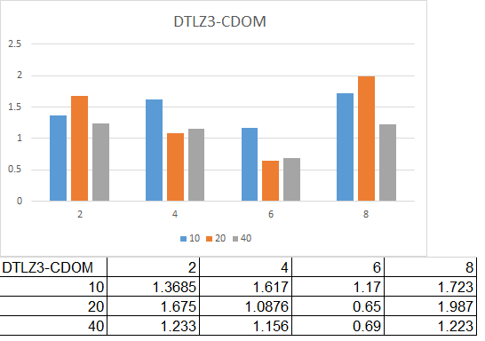
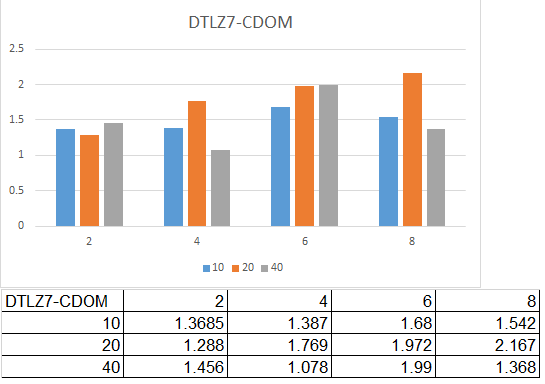

**Code 8 : Implement NSGA-II**

Extend the Genetic Algorithm (GA) such that it implements two variants of the NSGA-II algorithm.
- Binary Domination with cuboid sorting
- Continuous Domination

Run python main.py to run the experiments.

### Abstract
In this study, we have implemented NSGA-II (Non-Dominated Sorting Genetic Algorithm-II). We have basically extended the Genetic Algorithm (GA) and implemented the two variants of NSGA-II over it, i.e. Binary Domination (BDOM) with cuboid sorting and Continuous Domination (CDOM). This genetic algorithm is run on each of DTLZ 1 , 3, 5 , 7 each time with 2,4,6,8 objectives and each of 10, 20 , 40 decisions. The analysis of the performance of this algorithm is done using the hypervolume function where we have measured the hypervolume for 20 iterations and took a median of those values. Then, we plotted these results on bar charts to compare the performance and application of this algorithm on different variants of DTLZ. We have also used these results to compare the performance of BDOM and CDOM when run on the same input parameters.

### Keywords
- Binary domination - A candidate is said to binary dominate another candidate if its objective values are better in at least one instance and never worse
- Candidates - An instance of a solution. A candidate has decisions and fitness
- Decisions - Independent variables that are properties of every candidate and used to derive fitness
- Hypervolume - A set of candidates dominated by the pareto frontier
- Fitness - A measure of optimality of a candidate based on it's objective values
- DTLZ - A family of functions that can output multi-objective functions that should be minimized and are optimum at a particular profile
- Objectives - A derived value that can be minimized, maximised or converged to a value to determine how fit a candidate is
- Pareto Frontier - A set of candidates that dominate all other candidates
- Selection - The process of selecting a fit candidate from a generation
- Mutation - The process of randomly varying decision values in a candidate
- Crossover - The process of merging two candidates to produce two children


### Introduction and Background

A genetic algorithm (GA) is a metaheuristic inspired by the process of natural selection that belongs to the larger class of evolutionary algorithms (EA). Genetic algorithms are commonly used to generate high-quality solutions to optimization and search problems by relying on bio-inspired operators such as mutation, crossover and selection.  In a genetic algorithm we use selection to generate the best population, we then use mutation and crossover with the default probability to generate children. The children are then compared to the parents to see if the population is getting evolved for better. Multi-objective evolutionary algorithms (EAs) that use non-dominated sorting and sharing have been criticized mainly for their computational complexity O(MN2) (where M is the number of objectives and N is the population size), non-elitism approach and the need for specifying a sharing parameter. We suggest a non-dominated sorting-based multi-objective EA (MOEA), called non-dominated sorting genetic algorithm II (NSGA-II), which alleviates all the above three difficulties. Specifically, a fast non-dominated sorting approach with O(MN2) computational complexity is presented. Also, a selection operator is presented that creates a mating pool by combining the parent and offspring populations and selecting the best (with respect to fitness and spread) solutions. The objective of this study is to use the Genetic Algorithm as base and extend it to NSGA-II using Binary Domination with Cuboid Sorting and Continuous Domination.


### Implementation

Non-dominated sorting genetic algorithm–II was proposed by Deb et al. in 2000. It uses an elitist principle and emphasizes non-dominated solutions. It also uses an explicit diversity preserving mechanism.   NSGA is standard genetic algorithm (Crossover, mutation) with a state-of-the art selection operator for multi-objectives.

    -Divide candidates into frontiers
    -For some small number
        -Keep the top i-frontiers until we reach that number
        -If you fill up half way through a frontier,
        -Delete some using crowd-pruning

## Binary Domination and Continuous Domination

These are comparison operators used to compare pairs of candidates to find the better candidate. The comparison is done on the objectives of the candidate solutions. In Binary Domination we find the difference between the objectives generated by different candidate pairs. Continuous domination also finds this difference, however it finds the difference to an exponential power so that the difference becomes very loud and clear. For more number of objectives in a candidate, Binary Domination works worse and leads to crowding of the pareto frontier. However Continuous Domination works better for more number of objectives and does not lead to crowding of the frontier as the difference between candidates is calculated on an exponential level. Hence intricate differences get noticed.

Binary Dominator

```
def bdom(self):
    candidates = self.candidates
        n = self.num_candidates
        for candidate1 in candidates:
            can_dominates_all = True
            for candidate2 in candidates:
                if candidate2 > candidate1:
                    can_dominates_all = False
                    break
            if can_dominates_all:
                self.pop_pareto.append(candidate1)        

```

rdivDemo

```
def rdivDemo(data):
  def zzz(x):
    return int(100 * (x - lo) / (hi - lo + 0.00001))
  data = map(lambda lst:Num(lst[0],lst[1:]),
             data)
  print("")
  ranks=[]
  for x in scottknott(data,useA12=True):
    ranks += [(x.rank,x.median(),x)]
  all=[]
  for _,__,x in sorted(ranks): all += x.all
  all = sorted(all)
  lo, hi = all[0], all[-1]
  line = "----------------------------------------------------"
  last = None
  formatStr = '%%4s , %%%ss ,    %%s   , %%4s ' %  The.text
  print((formatStr  % \
               ('rank', 'name', 'med', 'iqr')) + "\n"+ line)
  for _,__,x in sorted(ranks):
    q1,q2,q3 = x.quartiles()
    print((formatStr % \
                 (x.rank+1, x.name, q2, q3 - q1))  + \
              xtile(x.all,lo=lo,hi=hi,width=30,show="%5.2f"))
    last = x.rank 
```

- How to run code
```
python main.py
```

### Experiments
- GA program is run 20 times for each Model (DTLZ1/3/5/7), Objectives (2,4,6,8), and Decisions(10,20,40)
- This result is input to the rdivDemo function in stats.py
- Results(Hypervolumes) were obtained from the stats that we have taken the median of and plotted into the graphs

### Results

- We can see that in most of the cases, the performance of the algorithm decreases with increase in number of objectives in case of binary domination. Also, the difference in performance of BDOM and CDOM is not much. Both perform almost equally and take the some time to execute. We have plotted the median results of hypervolumes on graphs as shown below for each DTLZ with 2,4,6,8 objectives and 10,20,40 objectives.


DTLZ1

    
  
DTLZ3

    
  
DTLZ5

    
  
DTLZ7

    
  
### Threads to validity
We found out that optimizing various DTLZ might result in faster and better results. So, the DTLZ code which we implemented might not be the best one and may need more optimization to give better results. We measured the performance based on just the hypervolume which can be a bit misleading as there can be various other metrics to measure the performance of these algorithms. Also, continuous domination should perform better than binary domination in most cases, but from our results it is not evident.

### Future Work
- We can optimize the algorithms (DTLZ and NSGA-II) to generate more accurate and fast output.
- We can increase the number of metrics used to judge the performance and compare them by plotting graphs amongst them. This would give much better understanding of actually what is going on.
- We can use different models to judge the performance of the algorithm.

### Conclusion
We concluded that as the number of objectives increase, the Binary Domination performs worse but in case

### Screenshot

Code running

  
  
  
  
### References

Deb and S. Agrawal and A. Pratap and T. Meyarivan, "A Fast Elitist Non–dominated Sorting Genetic Algorithm for Multi–Objective     Optimization: NSGA–II", 2000.

http://www.cleveralgorithms.com/nature-inspired/evolution/nsga.html

https://github.com/txt/ase16 

