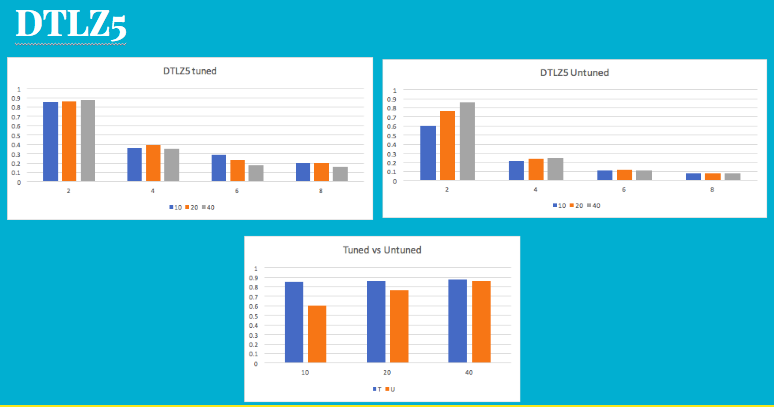
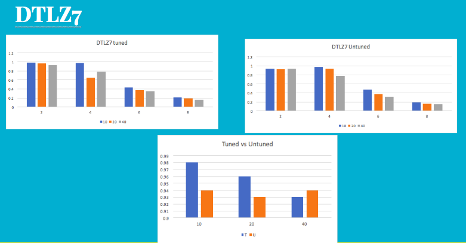

### Abstract
**Code9: Hyper parameter optimization (fun)**<br>
Use DE to tune your defaults for GAs.<br>

Create at least three options for mutation, crossover, select, number of candidates, number of generations. See if standard DE (default control settings) can improve on the scores seen in COde9.<br>

Using the statistical machinery discussed in class (Scott-Knott, a12, bootstrap) to decide in any of tuned or untuned GAs are best for DTLZ1,3,5,7 with 2,4,6,8 objectives and 10,20,40 decisions. Remember to repeat your runs of tuned vs untuned using the same baseline populations. Use the stats.py file given to test if your tunings are useful.<br>

Also comment on the computation cost of tuning.<br>

### Introduction

**Differential Evolution**<br>
Differential evolution (DE) is a method that optimizes a problem by iteratively trying to improve a candidate solution with regard to a given measure of quality. Such methods are commonly known as metaheuristics as they make few or no assumptions about the problem being optimized and can search very large spaces of candidate solutions. However, metaheuristics such as DE do not guarantee an optimal solution is ever found.<br>

DE is used for multidimensional real-valued functions but does not use the gradient of the problem being optimized, which means DE does not require for the optimization problem to be differentiable as is required by classic optimization methods such as gradient descent and quasi-newton methods. DE can therefore also be used on optimization problems that are not even continuous, are noisy, change over time, etc.<br>

DE optimizes a problem by maintaining a population of candidate solutions and creating new candidate solutions by combining existing ones according to its simple formulae, and then keeping whichever candidate solution has the best score or fitness on the optimization problem at hand. In this way the optimization problem is treated as a black box that merely provides a measure of quality given a candidate solution and the gradient is therefore not needed.<br>


**Genetic Algorithm**<br>
In computer science and operations research, a genetic algorithm (GA) is a metaheuristic inspired by the process of natural selection that belongs to the larger class of evolutionary algorithms (EA). Genetic algorithms are commonly used to generate high-quality solutions to optimization and search problems by relying on bio-inspired operators such as mutation, crossover and selection<br>
Genetic algorithms (GA) have proven a good alternative to Monte Carlo type optimization methods for global structure and materials properties optimization <br>

The GA implementation is diverse. It (or previous versions of it) has been used in publications with differing subjects such as structure of gold clusters on surfaces, composition of alloy nanoparticles, ammonia storage in mixed metal ammines and more. The implementation is structured such that it can be tailored to the specific problem investigated and to the computational resources available (single computer or a large computer cluster).<br>

**Scott-Knott**<br>

Scott-Knott (SK) is a hierarchical clustering algorithm used as an exploratory data analysis tool. It was designed to help researchers working with an ANOVA experiment, wherein the comparison of treatment means is an important step in order, to find distinct homogeneous groups of those means whenever the situation leads to a significant F-test.<br>

**Pareto-frontier**<br>

For a given system, the Pareto frontier or Pareto set is the set of parameterizations (allocations) that are all Pareto efficient. Finding Pareto frontiers is particularly useful in engineering. By yielding all of the potentially optimal solutions, a designer can make focused tradeoffs within this constrained set of parameters, rather than needing to consider the full ranges of parameters.<br>

**Dominance Comparator**<br>

We used binary over continuous domination domination since continuous domination did not scale well for the large magnitude of runs performed. As the same comparison operators would be used for both tuned and untuned runs we are measuring the difference in results by focussing more on the delta factor between the two runs than the actual values. <br>


### Implementation

- DE loop is run to determine arguments for running GA
- GA is run with these arguments(tuned) and with default arguments(untuned)
- Dominance Comparator- We used BDOM because CDOM was too slow for large magnitude of runs
- As new populations are created, pareto frontier is updated
- Objective function for GA is the value of hypervolume for resulting generation.

Main function (which looks like any other evolutionary optimizer) creates an frontier, tries to update it, stopping if we are good enough:

```
def de(max     = 100,  # number of repeats 
           np      = 100,  # number of candidates
           f       = 0.75, # extrapolate amount
           cf      = 0.3,  # prob of cross-over 
           epsilon = 0.01
         ):
      frontier = [candidate() for _ in range(np)] 
      for k in range(max):
        total,n = update(f,cf,frontier)
        if total/n > (1 - epsilon): 
          break
      return frontier
      ```
      
Binary Dominator

```
:

def bdom(self):
    candidates = self.candidates
        n = self.num_candidates
        for candidate1 in candidates:
            can_dominates_all = True
            for candidate2 in candidates:
                if candidate2 > candidate1:
                    can_dominates_all = False
                    break
            if can_dominates_all:
                self.pop_pareto.append(candidate1)        

```

### Experiments
- GA program is run 20 times for each Model (DTLZ1/3/5/7), Objectives (2,4,6,8), and Decisions(10,20,40)
- This result is input to the rdivDemo function in stats.py
- Following result was obtained from the stats that we have plotted into the graph

### Results

- We can see that in most of the cases, the tuned optimizer runs better. Using DE has improved the quality of input parameters to GA. 
- DTLZ7-2-10 gave the best solution with hypervolume of 0.98

DTLZ1

  
  
DTLZ3

  
  
DTLZ5

  
  
DTLZ7

  
  
### Threads to validity

Pareto frontier generated in this case is using binary domination. However, this results in poor quality of pareto_frontier. Although because of bdom, the execution is faster, it doesn't give the best solution. Also, we can see in the results that the tuned GA does not always give better solution. Therefore, we should run it multiple times to get the best solution for the tuned GA as well.

### Future Work

As we have seen, we can use some other tournament selection method to generate the pareto_frontier. This should hopefully give better solution. Also, we should run the algorithm multiple times to get the best tuned GA parameters. Because we have seen that not always, the tuned GA gives better solution than untuned GA.

### Conclusion

We concluded that in most of the cases tuned GA gives better solution. However this improvement comes with a cost. We need to first run DE to get the ga parameters and then run GA. This slows down the algorithm a lot. Also if we use another tournament selection method, the run time might be even longer. Number of computations increases and that is the cost of tuning

### Screenshot

Code running

  
  
### References

http://www.scielo.br/scielo.php?script=sci_arttext&pid=S2179-84512014000100002 <br>
https://en.wikipedia.org/wiki/Genetic_algorithm <br>
https://github.com/txt/ase16/blob/master/doc/de.md <br>
https://github.com/txt/ase16/blob/master/doc/stats.md <br>
https://wiki.fysik.dtu.dk/ase/ase/ga.html <br>
