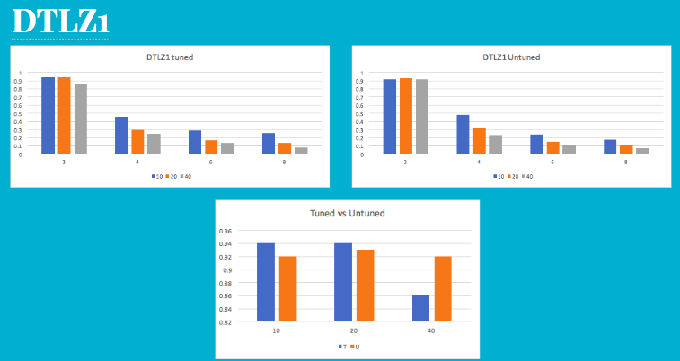
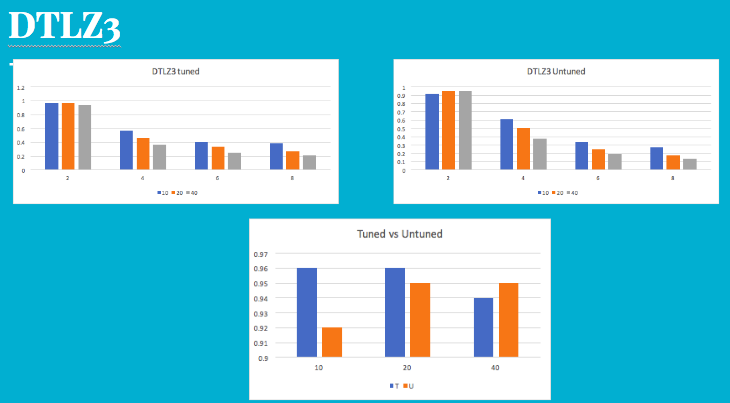
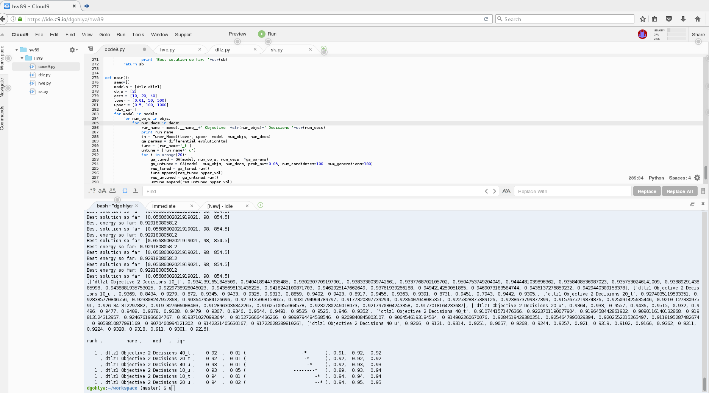

### Abstract
**Code9: Hyper parameter optimization (fun)** 
Use DE to tune your defaults for GAs. 

Create at least three options for mutation, crossover, select, number of candidates, number of generations. See if standard DE (default control settings) can improve on the scores seen in COde9. 

Using the statistical machinery discussed in class (Scott-Knott, a12, bootstrap) to decide in any of tuned or untuned GAs are best for DTLZ1,3,5,7 with 2,4,6,8 objectives and 10,20,40 decisions. Remember to repeat your runs of tuned vs untuned using the same baseline populations. Use the stats.py file given to test if your tunings are useful. 

Also comment on the computation cost of tuning. 

### Introduction

**Differential Evolution** 
Differential evolution (DE) is a method that optimizes a problem by iteratively trying to improve a candidate solution with regard to a given measure of quality. Such methods are commonly known as metaheuristics as they make few or no assumptions about the problem being optimized and can search very large spaces of candidate solutions. However, metaheuristics such as DE do not guarantee an optimal solution is ever found. 

DE is used for multidimensional real-valued functions but does not use the gradient of the problem being optimized, which means DE does not require for the optimization problem to be differentiable as is required by classic optimization methods such as gradient descent and quasi-newton methods. DE can therefore also be used on optimization problems that are not even continuous, are noisy, change over time, etc. 

DE optimizes a problem by maintaining a population of candidate solutions and creating new candidate solutions by combining existing ones according to its simple formulae, and then keeping whichever candidate solution has the best score or fitness on the optimization problem at hand. In this way the optimization problem is treated as a black box that merely provides a measure of quality given a candidate solution and the gradient is therefore not needed. 

Ref: Class notes 

**Genetic Algorithm** 
In computer science and operations research, a genetic algorithm (GA) is a metaheuristic inspired by the process of natural selection that belongs to the larger class of evolutionary algorithms (EA). Genetic algorithms are commonly used to generate high-quality solutions to optimization and search problems by relying on bio-inspired operators such as mutation, crossover and selection 

Ref: Wikipedia 

**Scott-Knott** 

Scott-Knott (SK) is a hierarchical clustering algorithm used as an exploratory data analysis tool. It was designed to help researchers working with an ANOVA experiment, wherein the comparison of treatment means is an important step in order, to find distinct homogeneous groups of those means whenever the situation leads to a significant F-test. 
Ref: http://www.scielo.br/scielo.php?script=sci_arttext&pid=S2179-84512014000100002  

### Implementation

- DE loop is run to determine arguments for running GA
- GA is run with these arguments(tuned) and with default arguments(untuned)
- Dominance Comparator- We used BDOM because CDOM was too slow for large magnitude of runs
- As new populations are created, pareto frontier is updated
- Objective function for GA is the value of hypervolume for resulting generation.

### Experiments
- GA program is run 20 times for each Model (DTLZ1/3/5/7), Objectives (2,4,6,8), and Decisions(10,20,40)
- This result is input to the rdivDemo function in stats.py
- Following result was obtained from the stats that we have plotted into the graph

### Results

- We can see that in most of the cases, the tuned optimizer runs better. Using DE has improved the quality of input parameters to GA. 
- DTLZ7-2-10 gave the best solution with hypervolume of 0.98

**DTLZ1**
  
**DTLZ2**
  
**DTLZ3**
  
**DTLZ4**
  

### Screenshot

**Code running**
  
