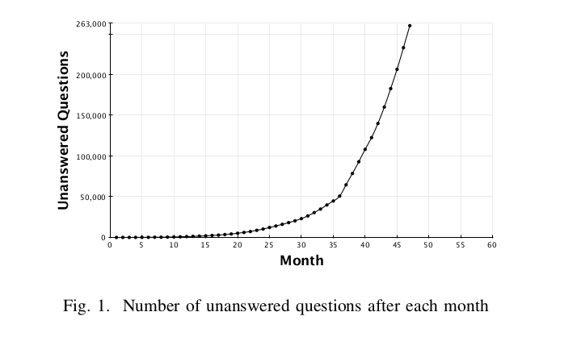
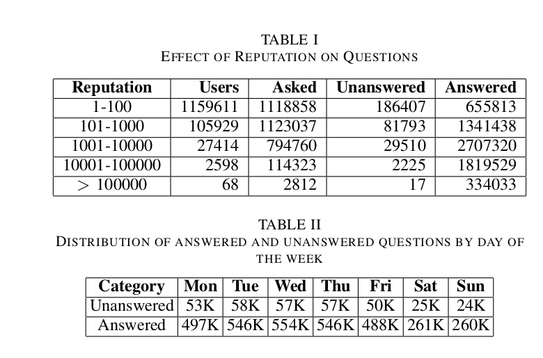

### Team D

### Reference
Answering Questions about Unanswered Questions  of Stack Overflow
Muhammad Asaduzzaman, Ahmed Shah Mashiyat, Chanchal K. Roy, Kevin A. Schneider

### Keywords 

- **Stack Overflow** - Stack Overflow is a privately held website, the flagship site of the Stack Exchange Network,created in 2008 by Jeff Atwood and Joel Spolsky. It was created to be a more open alternative to earlier question and answer sites such as Experts-Exchange.

- **Reputation** - Reputation is a rough measurement of how much the community trusts you; it is earned by convincing your peers that you know what you’re talking about. The more reputation you earn, the more privileges you gain.

- **Moderators** - Moderators are human exception handlers, there to deal with those exceptional conditions that could otherwise disrupt the community.

- **Data Mining** - Data mining is an interdisciplinary subfield of computer science. It is the computational process of discovering patterns in large data sets involving methods at the intersection of artificial intelligence, machine learning, statistics, and database systems

### Notes

- **Study Instruments** - They have manually investigated a random sample of unanswered questions. They use both question content and comments to understand why the questions were unanswered. Finally, they consider how this information can be used to better support the SO site and build classifiers for predicting the number of days a question will remain unanswered.

- **Informative Visualizations** 
  

- **Related Work**
Prior work on community Q&A services focused on studying the dynamics of community activities. Anderson et al.(Discovering value from community activity on focused question answering sites: a case study of stack overflow) used such knowledge to predict the long lasting value of a question and to decide whether a question has been sufficiently answered. The closest research to this study is the work of Nasehi et al., who studied SO Q&A threads to understand characteristics of good code examples.

- **Future Work**
Moderators can use the classifier to predict questions likely to have delayed responses and can consider taking actions to promote an earlier response, such as editing the question or routing the question to an expert member and identifying the quality of a question is a future work which can help in this regard.	

### Needs Improvement
- The study seems to be abstract and I think it requires some more digging into the reasons surrounding the unanswered SO questions. 
- Maybe an interview with moderators or the well reputed members of the community can help understand the problem better. I feel that the user surveys and some more study instruments should have been used to dig deep into the problem.
- Also, the study fails to highlight the fact that over the past 2 years, a great increase in number of people using stackoverflow.com might have also resulted in the increase in number of unanswered questions. There seems to be some missing data.  

