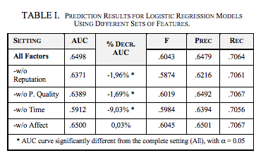
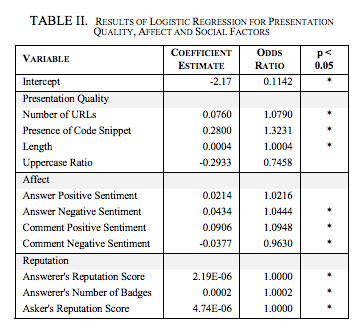
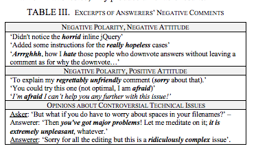

### Team D

### Reference
Mining Successful Answers in Stack Overflow

### Keywords 

- **Sentiment Analysis** - Sentiment analysis involves classifying opinions in text into categories like "positive" or "negative" often with an implicit category of "neutral".

- **Knowledge Discover** - It is the process of discovering useful knowledge from a collection of data.

- **Data Mining** - Data mining is an interdisciplinary subfield of computer science. It is the computational process of discovering patterns in large data sets involving methods at the intersection of artificial intelligence, machine learning, statistics, and database systems.

- **Logistics** - the detailed coordination of a complex operation involving many people, facilities, or supplies.

### Notes

- **Study Instruments** - They extracted their dataset from the official SO data dump, updated on September 2014. SO official datasets always report the reputation score of users when the dump is created.
The SO reputation system assigns users to the following categories, based on the reputation score gained: New Users (score <10), Low Reputation Users (score in [10, 1000[), Established Users (score in [1000, 20k[), and Trusted Users (score ≥ 20k). 
Since SO allows users to gain at most 200 reputation points per day, it is reasonable to assume that the reputation category of the largest majority of users stays unvaried over a month.

- **Pattern for successful answer** 
  1. Presentation Quality - Writing a good answer in SO involves successfully complying with the community standards of presentation quality.
  2. Affect - To capture the sentiment of answers and comments, they use SentiStrength, a state-of-the-art tool already employed in social computing, which is capable of dealing with short written informal texts, including abbreviations, intensifiers and emoticons.
  3. Time - Speed is among the key factors of success of SO. The median time for a first answer is only 11 minutes (21’20’’ for an accepted answer). Expert users are also the fastest contributors, resulting in a high probability of askers accepting the first answer
  4. Reputation - The social reputation system of SO is designed to incentivize contributions and allow assessment of trustworthiness of users.
  
- **Informative visualizations**
  

- **Future Work** - First, the wide variety of affective states expressed in comments recommends a more fine-grained investigation of the role of emotions in SO since different affective states might be relevant to different contexts and tasks. 
Besides, it would be interesting to investigate to what extent emotions and personality traits shown in questions influence the answering behavior. 
Finally, they underline the need for tuning state-of-the-art resources for sentiment detection by adapting them to domain-dependent use of lexicon. 

### Needs Improvement
  - Authors have not taken into consideration fine-grained investigation of the role of emotions in SO which might be relevant to different contexts and tasks
  - Authors have not tuned state-of-the-art resources for sentiment detection.
